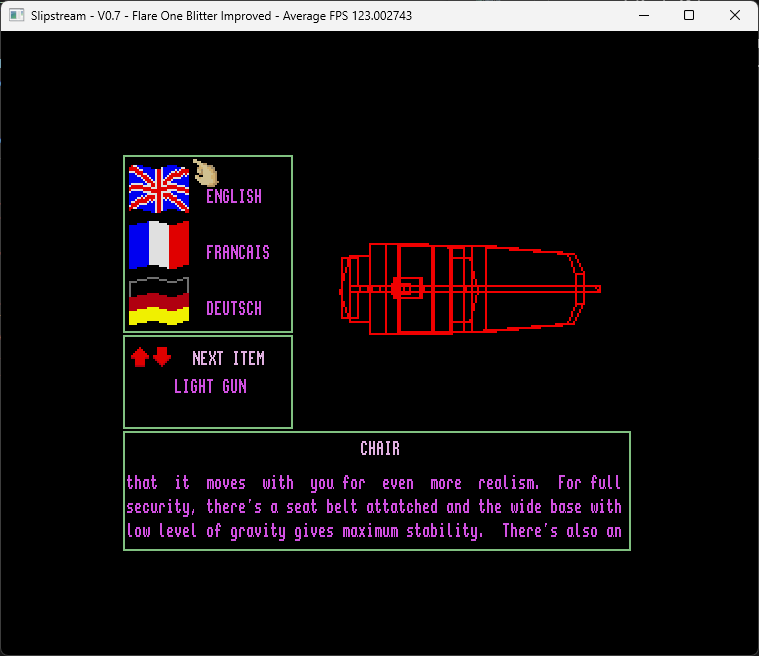

Flare One - Hitchhikers Demo (Demo used to promote future Konix Multisystem Hardware)



The sources in the Sources folder were originally compiled with the PDS system. However [Z80 Assembler](https://github.com/Konix-Multisystem/FlareOne_Assembler) can be used to assemble the source into the HITCH.FL1 image used for running on the Slipstream emulator.

```
cd Sources
<path_to_assembler> ALL.Z80 -o ../HITCH.FL1
```
